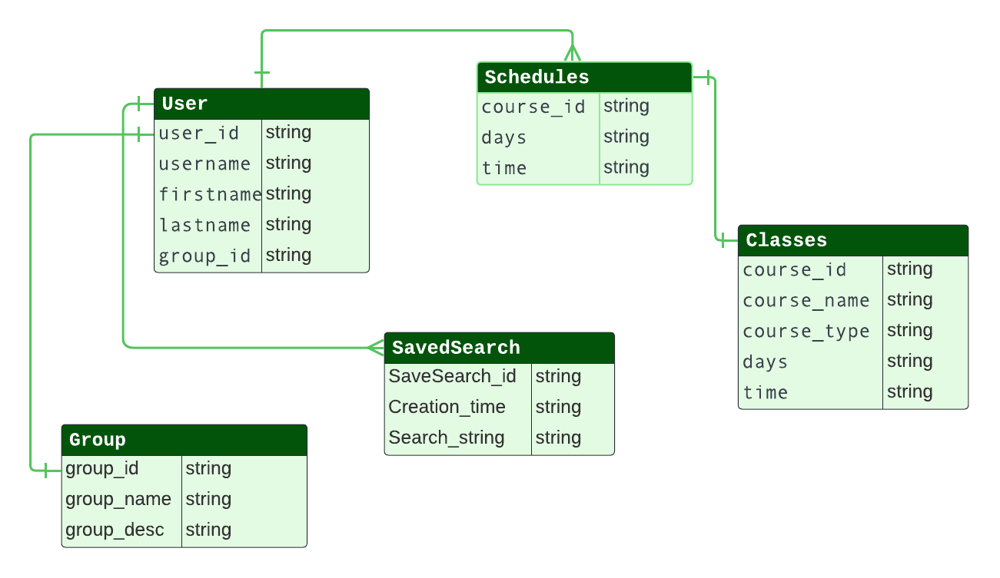

# Supplementary Course Analyzer

This App will be used to help professors at Sac State create PAL classes for the students

## Table Of Contents

[Background](#background)
[Technology](#technology)
[Testing](#testing)
[Deployment](#deployment)
[Developer Instructions](#developer-instructions)
[Contributors](#contributors)
[Installation](#installation)
[Timeline](#timeline)

## Background

The professors at Sacramento State have been struggling to generate schedules for PAL courses. The challenge they face is selecting a suitable time for each PAL course to ensure it's accessible to the students who need it. The goal of the Sac State PAL Course Analyzer is to assist the PAL program in its class scheduling process. Our project aggregates all courses that have an associated PAL class, examines the scheduled times for these courses, and identifies which students are enrolled in which courses to select the optimal time for a PAL course.

Peer Assisted Learning (PAL) offers 1-unit courses available for students enrolled in gateway science and math courses. Students who have already taken a course come and help mentor/tutor other students who are currently taking the course. It gives an opportunity for Sacramento State students to give back and help their peers in their pursuit of education.

## Technology

-Tech Stack: React, Node.js, MaterialsUI, Firebase,\
-Status: Developmental stages

## Testing

## Deployment

## Developer Instructions

## Prototyping Images
ERD Diagram 

Prototype Home Page

Prototype Login Page

## Current Examples
Home Page

Login Page

Registration Page

## Contributors

Shajaat Ali\
Raj Pannu\
Shaquan Carolina\
Chi Andrus\
Kyle Diep\
JD Cruz\
David Chatla\
Ian Charamuga

<<<<<<< HEAD
In the project directory, you can run:
## ER Diagram

=======
## Installation
>>>>>>> upstream/main

npm install\
npm start

## Timeline

